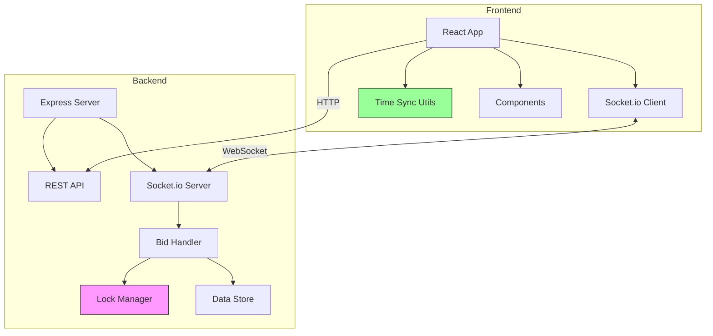

# Live Bidding Platform

A real-time auction platform where users compete to buy items in the final seconds. Built with Node.js, Socket.io, React, and Docker.

## Features

- **Real-time Bidding**: Instant bid updates across all connected clients using Socket.io
- **Race Condition Handling**: Mutex-based locking ensures only one bid processes at a time per item
- **Synchronized Timers**: Server-time synchronization prevents client-side timer manipulation
- **Simple UI**: Clean, functional interface with status indicators
- **Docker Support**: Easy deployment with Docker and Docker Compose

## Important Notes

> **Data Persistence**: This implementation uses **in-memory storage** for simplicity and demonstration purposes. Auction times are calculated relative to server start time, meaning fresh auctions are created on each restart. This is intentional for the demo/assessment scope.

> **Production Considerations**: For a production environment, this would be enhanced with:
> - Persistent database (MongoDB, PostgreSQL, or Redis)
> - Fixed auction end times stored in the database
> - User authentication and authorization
> - Payment gateway integration
> - Comprehensive error handling and logging
> - Rate limiting and security measures

## Architecture



## Technology Stack

### Backend
- **Node.js** - Runtime environment
- **Express** - Web framework
- **Socket.io** - Real-time bidirectional communication
- **In-memory storage** - Simple data persistence (easily upgradeable to Redis/DB)

### Frontend
- **React** - UI library
- **Vite** - Build tool
- **Socket.io Client** - Real-time updates
- **Vanilla CSS** - Simple styling

### Infrastructure
- **Docker** - Containerization
- **Docker Compose** - Multi-container orchestration
- **Nginx** - Frontend static file serving

## Quick Start

### Using Docker (Recommended)

1. **Clone and navigate to the project**
   ```bash
   cd Live_Bidding
   ```

2. **Start the application**
   ```bash
   docker-compose up --build
   ```

3. **Access the application**
   - Frontend: http://localhost:3000
   - Backend API: http://localhost:5000/api/items
   - Health Check: http://localhost:5000/health

### Local Development

#### Backend Setup

```bash
cd backend
npm install
npm start
```

The backend server will run on http://localhost:5000

#### Frontend Setup

```bash
cd frontend
npm install
npm run dev
```

The frontend will run on http://localhost:3000

## API Documentation

### REST Endpoints

#### GET /api/items
Returns all auction items with current state.

**Response:**
```json
{
  "success": true,
  "data": [
    {
      "id": "1",
      "title": "Vintage Camera",
      "description": "Classic 35mm film camera",
      "image": "https://...",
      "startingPrice": 50,
      "currentBid": 50,
      "currentBidder": null,
      "auctionEndTime": "2026-01-28T13:30:00.000Z",
      "bidHistory": []
    }
  ],
  "serverTime": "2026-01-28T13:00:00.000Z"
}
```

#### GET /api/server-time
Returns current server time for synchronization.

#### GET /health
Health check endpoint.

## Socket.io Events

### Client → Server

#### BID_PLACED
Emitted when a user places a bid.

**Payload:**
```javascript
{
  itemId: "1",
  bidAmount: 60,
  bidderId: "socket-id-123"
}
```

### Server → Client

#### SERVER_TIME
Sent on connection to synchronize client time.

**Payload:**
```javascript
{
  serverTime: "2026-01-28T13:00:00.000Z"
}
```

#### UPDATE_BID
Broadcast to all clients when a bid is accepted.

**Payload:**
```javascript
{
  itemId: "1",
  newBid: 60,
  bidderId: "socket-id-123",
  timestamp: "2026-01-28T13:00:00.000Z"
}
```

#### BID_ERROR
Sent to the bidder if their bid is rejected.

**Payload:**
```javascript
{
  itemId: "1",
  error: "Bid must be higher than current bid",
  currentBid: 60
}
```

## Race Condition Handling

The platform handles concurrent bids using a **mutex-based locking mechanism**:

1. When a bid arrives, the server acquires a lock for that specific item
2. The bid is validated (amount, auction status)
3. If valid, the item state is updated
4. The lock is released
5. If another bid arrives while locked, it waits in a queue

This ensures **only one bid processes at a time per item**, preventing race conditions even when multiple users bid simultaneously.

## Timer Synchronization

To prevent client-side timer manipulation:

1. Server sends its current time when client connects
2. Client calculates the offset between server time and local time
3. All countdowns use this offset to display accurate server time
4. Even if user changes their system clock, timers remain accurate

## Project Structure

```
Live_Bidding/
├── backend/
│   ├── data/
│   │   └── items.js          # In-memory data store
│   ├── routes/
│   │   └── items.js          # REST API routes
│   ├── socket/
│   │   └── bidHandler.js     # Socket.io event handlers
│   ├── utils/
│   │   └── lockManager.js    # Race condition prevention
│   ├── server.js             # Main server file
│   ├── package.json
│   ├── Dockerfile
│   └── .env
├── frontend/
│   ├── src/
│   │   ├── components/
│   │   │   ├── AuctionDashboard.jsx
│   │   │   ├── AuctionCard.jsx
│   │   │   └── CountdownTimer.jsx
│   │   ├── utils/
│   │   │   ├── socket.js     # Socket.io client
│   │   │   └── timeSync.js   # Time synchronization
│   │   ├── styles/
│   │   │   └── index.css
│   │   ├── App.jsx
│   │   └── main.jsx
│   ├── index.html
│   ├── vite.config.js
│   ├── package.json
│   ├── Dockerfile
│   └── .env
├── docker-compose.yml
├── .gitignore
└── README.md
```

## Environment Variables

### Backend (.env)
```
PORT=5000
CORS_ORIGIN=http://localhost:3000
```

### Frontend (.env)
```
VITE_API_URL=http://localhost:5000
VITE_SOCKET_URL=http://localhost:5000
```

## Testing

### Test Race Conditions
1. Open the app in 2 browser windows
2. Click "Bid" simultaneously on the same item
3. Only one bid should succeed; the other gets an error

### Test Timer Sync
1. Open the app in multiple windows
2. Compare countdown timers - they should match
3. Change your system clock
4. Timers should still show correct server time

### Test Real-time Updates
1. Open multiple browser windows
2. Place a bid in one window
3. All windows should update instantly

